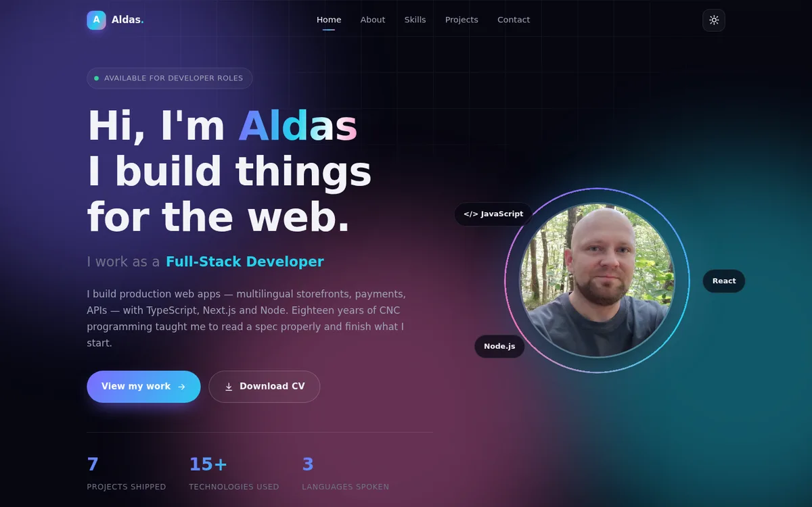
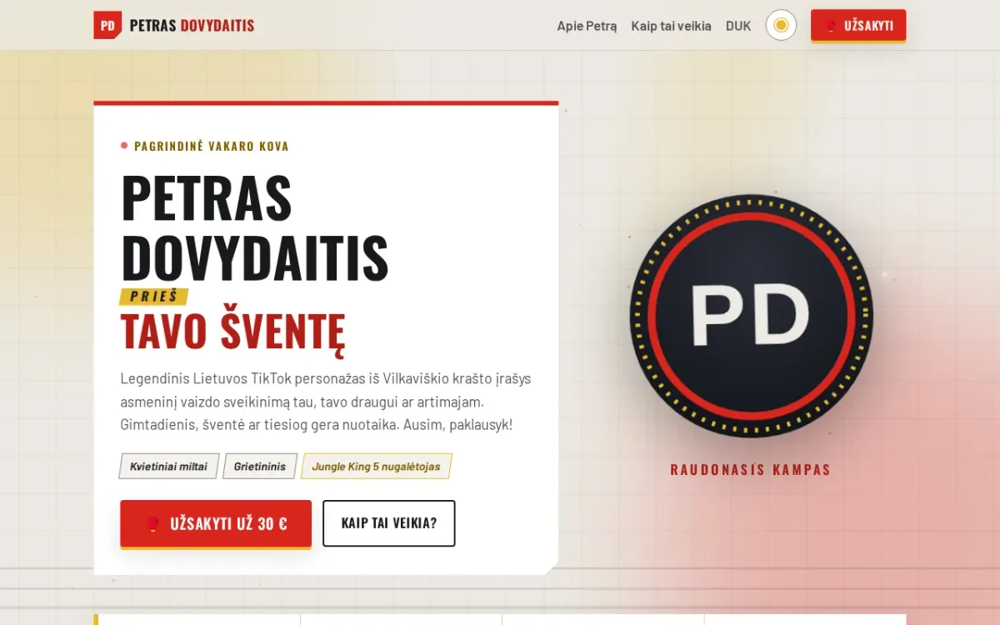
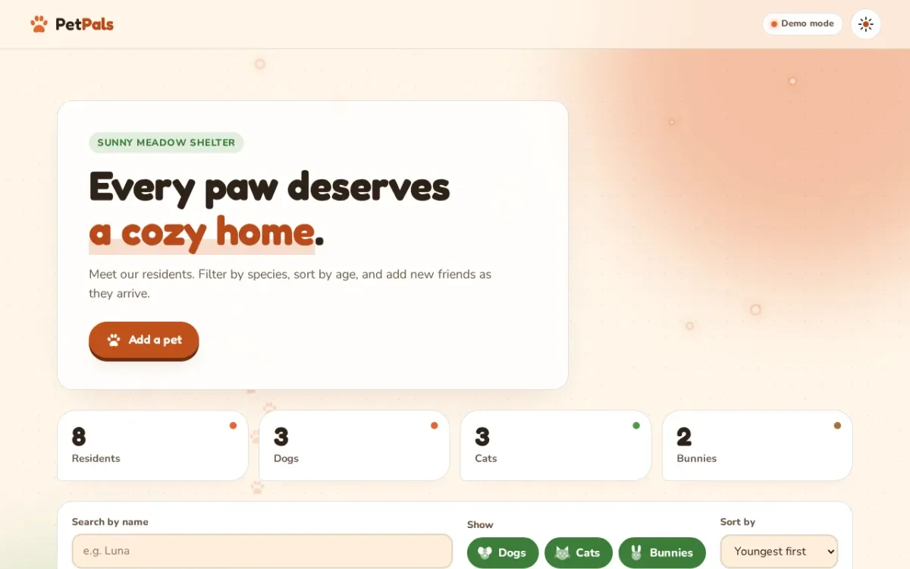
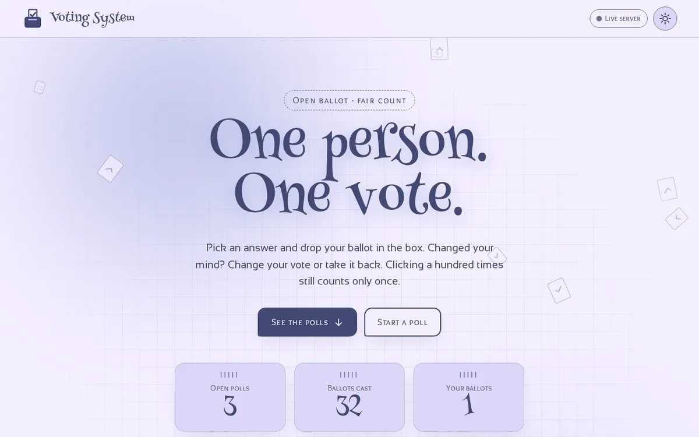
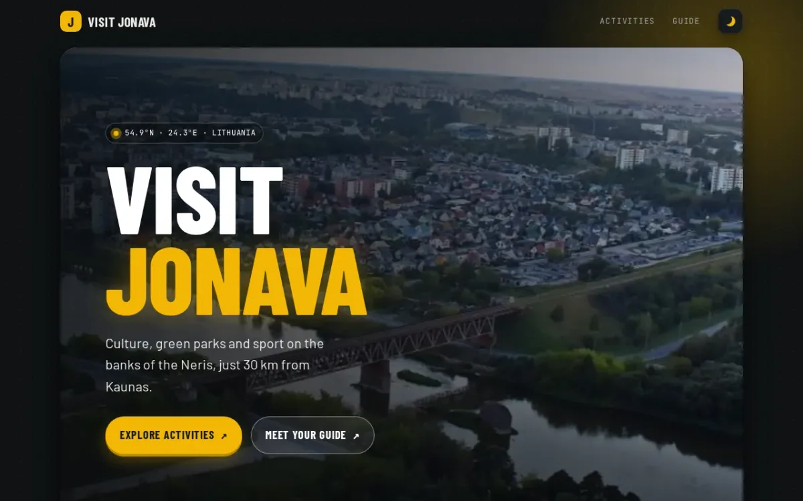
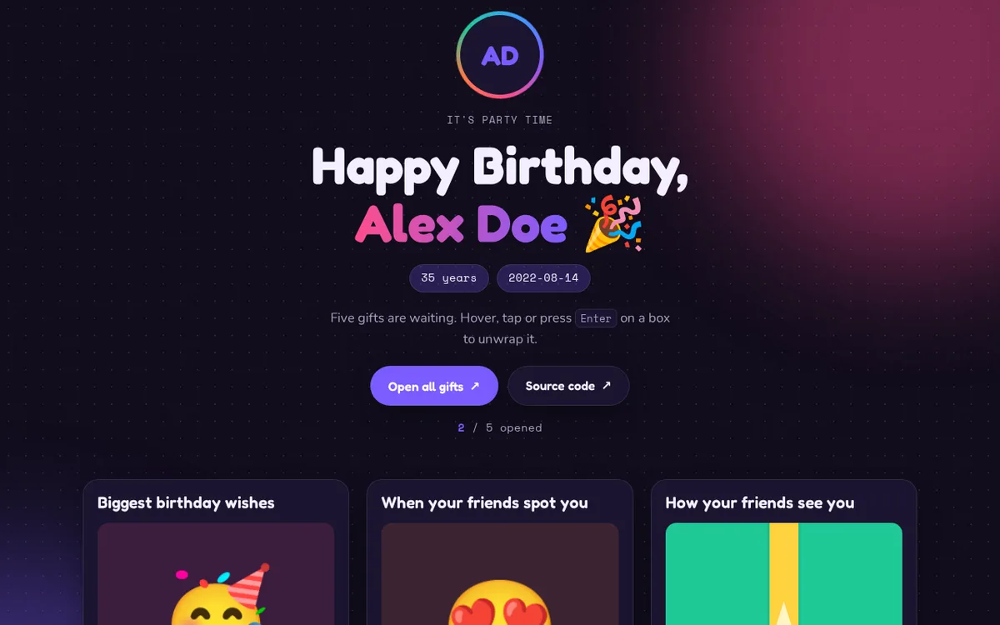
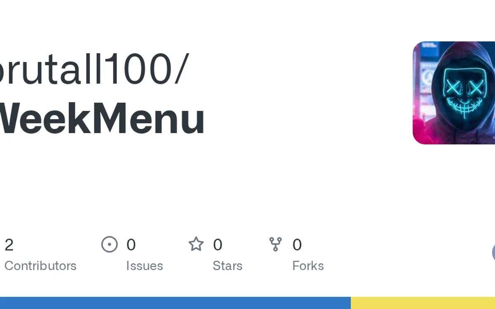
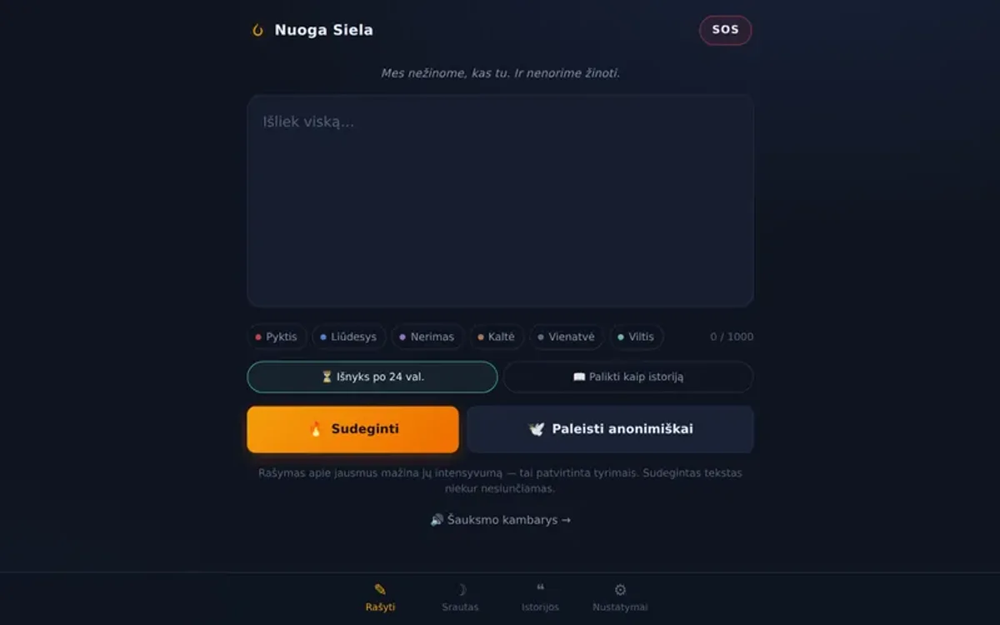
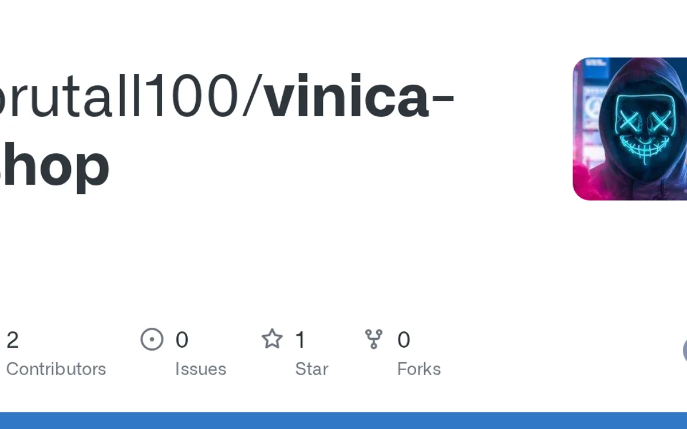

# Hi, I'm Aldas 👋

**Full-stack web developer** building production apps with TypeScript, Next.js and Node.
Eighteen years of CNC programming taught me to read the spec properly, debug patiently and ship on the date.

- 🌱 Open to **developer roles**
- 🌍 Lithuanian (native) · English · Russian

## 🛠️ Tech stack

<!-- Tech stack and projects below are rebuilt daily by .github/workflows/update-readme.yml — edit profile.config.json, not these blocks. -->
<!-- TECH:START -->

<!-- TECH:END -->

## 🚀 Featured projects

<!-- PROJECTS:START -->
<table>
  <tr>
    <td width="50%" valign="top">
      
      <h3>aldas-portfolio</h3>
      
Mano portfolio puslapis. 

      
HTML5 · CSS · JavaScript

      
<a href="https://aldas-portfolio.site/">Live</a> · <a href="https://github.com/brutall100/aldas-portfolio">Code</a>

    </td>
    <td width="50%" valign="top">
      
      <h3>petras-dovydaitis</h3>
      
Petro Dovydaičio vaizdo sveikinimų užsakymo puslapis: kovos plakato dizainas, gyvas ringo prožektorių fonas, demo režimas ir Node + SQLite serveris.

      
HTML5

      
<a href="https://brutall100.github.io/petras-dovydaitis/">Live</a> · <a href="https://github.com/brutall100/petras-dovydaitis">Code</a>

    </td>
  </tr>
  <tr>
    <td width="50%" valign="top">
      
      <h3>petpals-express-mongodb</h3>
      
🐾 Cozy pet shelter app: Express + MongoDB REST API with full CRUD, live paw-trail background, light/dark themes and a browser demo mode.

      
JavaScript · CSS · HTML5

      
<a href="https://brutall100.github.io/petpals-express-mongodb/">Live</a> · <a href="https://github.com/brutall100/petpals-express-mongodb">Code</a>

    </td>
    <td width="50%" valign="top">
      
      <h3>voting-system</h3>
      
One person, one vote: a polling app where you can cast, change or withdraw your vote. Node.js + Express 5 + built-in SQLite, with a browser demo mode.

      
JavaScript · CSS · HTML5

      
<a href="https://brutall100.github.io/voting-system/">Live</a> · <a href="https://github.com/brutall100/voting-system">Code</a>

    </td>
  </tr>
  <tr>
    <td width="50%" valign="top">
      
      <h3>scrimba-hometown-jonava</h3>
      
One-page travel guide to Jonava, Lithuania — responsive landing page with light/dark themes and playful micro-interactions. Scrimba project.

      
CSS · HTML5 · JavaScript

      
<a href="https://brutall100.github.io/scrimba-hometown-jonava/">Live</a> · <a href="https://github.com/brutall100/scrimba-hometown-jonava">Code</a>

    </td>
    <td width="50%" valign="top">
      
      <h3>scrimba-birthday-gift</h3>
      
Interactive birthday card — unwrap CSS-drawn gifts to reveal animated surprises and confetti. Scrimba practice project.

      
CSS · HTML5 · JavaScript

      
<a href="https://brutall100.github.io/scrimba-birthday-gift/">Live</a> · <a href="https://github.com/brutall100/scrimba-birthday-gift">Code</a>

    </td>
  </tr>
  <tr>
    <td width="50%" valign="top">
      
      <h3>WeekMenu</h3>
      

      
TypeScript · JavaScript · Sass · CSS · HTML5

      
<a href="https://github.com/brutall100/WeekMenu">Code</a>

    </td>
    <td width="50%" valign="top">
      
      <h3>nuoga-siela</h3>
      

      
TypeScript · JavaScript · HTML5 · CSS

      
<a href="https://github.com/brutall100/nuoga-siela">Code</a>

    </td>
  </tr>
  <tr>
    <td width="50%" valign="top">
      
      <h3>vinica-shop</h3>
      

      
TypeScript · JavaScript · CSS

      
<a href="https://github.com/brutall100/vinica-shop">Code</a>

    </td>
  </tr>
</table>
<!-- PROJECTS:END -->

More on my [portfolio site](https://aldas-portfolio.site/#projects).
